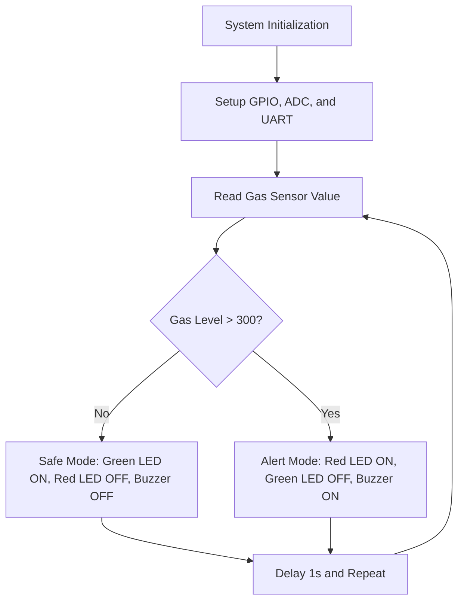

# samsung-riscv
## Hosted by
Global Academy of Technology, Electronics and Communication Engineering Department, in collaboration with **VLSI System Design** and the **Tech Connect Club**.

This workshop is part of the **Digital India RISC-V Mission 2025**, powered by **Samsung Semiconductor India Research (SSIR)**.

---

## Workshop Details
**Date**: 6th & 7th January  
**Venue**: Global Academy of Technology, Rajarajeshwari Nagar, Bengaluru - 560098

---

## Workshop Agenda

### **Part I: From Apps to Machine Code**
- Topic: How RISC-V simplifies the process of translating applications to machine code.

### **Part II: Converting RISC-V Verilog**
- Topic: Using open-source EDA tools to convert RISC-V Verilog RTL to GDS.

### **Part III: Programming the VSD Squadron Mini RISC-V Development Board**
- Topic: Hands-on programming experience with the VSD Squadron board.

---

## Resource Person
**Kunal Ghosh**
- Founder of VLSI System Design (VSD)
- IITian with over 15 years of experience in the VLSI industry.

---

## Highlights
- **Certification**: Certified by Samsung and VLSI System Design.
- **Internship Opportunity**: Secure a free internship in VLSI and Embedded Systems domain by attending the workshop.
- **Hands-On Learning**: Learn about cutting-edge open-source tools and RISC-V hardware.

---
## Tasks
<details>
<summary> Task 1:To perform C_Based and RISC-V lab  </summary>
<br> 

- To create a GitHub repository named "samsung-riscv" and watch the provided videos to understand the program flow.
  
-  Install the RISC-V toolchain using the VDI link mentioned in the shared PDF
   
- Refer to the C-based and RISC-V-based lab videos, replicate the steps on your machine, and capture snapshots of the process with the current date/time visible.
 
- simple c program
 

- disassembly code
-

-
</details>

<details>
<summary> Task 2:Spike Simulation  </summary>
<br>
-Spike is a RISC-V architecture simulator that allows for the simulation of RISC-V programs and software stacks.

-The objective is to execute the `fact.c` code using both the `GCC compiler` and the `RISC-V  compiler`
, ensuring that both produce identical outputs in the terminal. To compile the code with the GCC compiler, use the following command.
- step 1:Compile the c code using `gcc copmiler` 
 ```Step1
$ gcc fact.c
$ ./a.out
```
- step 2: Compile the code with `riscv compiler`
 
- using -O1 instruction.
```step2
$ riscv64-unknown-elf-gcc -O1 -mabi=lp64 -march=rv64i -o fact.o fact.c
```

- using -Ofast instruction.
```
$ riscv64-unknown-elf-gcc -Ofast -mabi=lp64 -march=rv64i -o fact.o fact.c
```


- Open the Objdump of code by using the below command
```bash
$ riscv64-unknown-elf-objdump -d sum_1ton.o | less  
```
- Open the debugger in another terminal by using the below command
```bash
$  spike -d pk fact.o 
```
- The rest steps are shown in the following snapshot.

</details>
<details>
<summary> Task 3: RISC-V instructions</summary>

  ## RISC-V Instruction Types

### R-Type:

- Purpose: Used for register-to-register operations (e.g., addition, subtraction, bitwise operations).
> Fields: The layout for a **U-type** instruction is as follows
>| func7 | rs2 | rs1 | func3 | rd | opcode |
>|-------|----|----|-------|-----|-------|
>| 7 bits | 5 bits |5 bits |3 bits |5 bits | 7 bits |
- Example: add rd, rs1, rs2.
---
### I-Type:

- Purpose: Used for immediate arithmetic operations, loads, and JALR.
> Fields: The layout for an **I-type** instruction is as follows:
> | imm[11:0] | rs1 | func3 | rd | opcode |
> |-----------|-----|-------|----|--------|
> | 12 bits | 5 bits  | 3 bits | 5 bits | 7 bits |
- Example: addi rd, rs1, imm or ld rd, offset(rs1).
---
### S-Type:

- Purpose: Used for store instructions (storing register values to memory).
> Fields: The layout for an **S-type** instruction is as follows:
> | imm[11:5] | rs2 |rs1 | func3 | imm[4:0] | opcode |
> |-----------|-----|-----|------|----------|--------|
> | 7 bits | 5 bits  | 5 bits | 3 bits | 5 bits | 7 bits |
- Example: sb rs2, offset(rs1).
---
### B-Type:

- Purpose: Used for branch instructions (conditional jumps).
> Fields: The layout for an **B-type** instruction is as follows:
> | imm [12] | imm[10:5] | rs2 |rs1 | func3 | imm[4:1] | imm[11] | opcode |
> |----------|-----------|-----|----|-------|----------|--------|--------|
> | 1 bit | 6 bits  | 5 bits |5 bits | 3 bits | 4 bits | 1bits | 7 bits |
- Example: beq rs1, rs2, offset.
---
### U-Type:

- Purpose: Used for loading upper immediate values into a register.
> Fields:The layout for an **U-type** instruction is as follows:
> | imm[31:12] | rd | opcode |
>|------------|----|--------|
>| 20 bits | 5 bits | 7 bits |
- Example: auipc rd, imm.
---
 ### J-Type:

- Purpose: Used for jump instructions (e.g., jal).
> Fields:The layout for an **J-type** instruction is as follows:
> | imm [20] | imm[10:1] | imm[11] | imm[19:12] | rd | opcode |
> |----------|-----------|---------|------------|---|----------|
> | 1 bit | 11 bits  | 1 bit |7 bits | 5 bits | 7 bits |
- Example: jal rd, offset.

---
### Here is the 15 unique RISCV instructions 
- 1 
```
add r10, r1, r2
```
> The RISC-V instruction format for `add ` is **R-type** ,meaning it adds the values stored in register r1 and register r2 and stores the result in register r10.
> The layout for a **R-type** instruction is as follows
>| func7 | rs2 | rs1 | func3 | rd | opcode |
>|-------|----|----|-------|-----|-------|
>| 7 bits | 5 bits |5 bits |3 bits |5 bits | 7 bits |
>
> opcode for LUI : 000000   
> rd : r10 = 01010   
> rt : 00001
> rs2 : 00010 
> funct3 : 00000 
> funct7 : 100000

---
#### 32-bit Instruction Encoding:00000010101100000000_01010_0110111
---
- 2 
```
addi sp,sp, -48
```
> The RISC-V instruction format for `ADDI` is **I-type**,which is used for instructions that add an immediate value to a resistor .
> The layout for an **I-type** instruction is as follows:
> | imm[11:0] | rs1 | func3 | rd | opcode |
> |-----------|-----|-------|----|--------|
> | 12 bits | 5 bits  | 3 bits | 5 bits | 7 bits |
>
> opcode for ADDI : 0010011   
> imm[11:0] (12 bits) -48 : 1111111111100  
> rd :  00010   
> rs1 : 00010 (register `sp`,which is x2)   
> funct3 for ADDI: 000   

 ---
#### 32-bit Instruction Encoding: 1111111111000000_00010_000_00010_0010011
---
-  3 
```
sd ra, 40(sp)
```
> The RISC-V instruction format for `SD` is **S-type**,which is used for instructions that add an immediate value to a resistor .
> The layout for an **S-type** instruction is as follows:
> | imm[11:5] | rs2 |rs1 | func3 | imm[4:0] | opcode |
> |-----------|-----|-----|------|----------|--------|
> | 7 bits | 5 bits  | 5 bits | 3 bits | 5 bits | 7 bits |
>
> opcode for SD : 0100011   
> imm[11:5] (7 bits for the upper part of the immediate) :0000100   
> imm[4:0] (5 bits for the lower part of the immediate) :  00000  
> rs1 : 00010 (register `sp`,which is x2)    
> rs2 : 00001 (register `x1` binary representation of 1)  
> func3 for SD: 011    

 ---
 #### 32-bit Instruction Encoding: 0000100_00001_00010_011_00000_0100011
---
 -  4 
 ```
auipc a5, 0xffff0
```
> The RISC-V instruction format for `AUIPC` is **U-type**,which is used for computing the sum of program counter (PC) and a 20-bit immediate value,and stores in resistor a5. 
> The layout for an **U-type** instruction is as follows:
> | imm[31:12] | rd | opcode |
>|------------|----|--------|
>| 20 bits | 5 bits | 7 bits |
>
> opcode for AUPIC :0010111
> rd (5 bits) `a5`(register x15) : 01111  
> imm[31:12] (20 bits) :1111111111111111   
> rs1 : N/A     
> rs2 : N/A  
> func3 for SD: N/A  

---
#### 32-bit Instruction Encoding:1111111111111111_01111_0010111

---
 -  5 
```
beqz a5, 10158
```
> The RISC-V instruction format for `BEQZ` is **B-type**,this instruction checks if the value in register `a5` is zero .If it is , the program branches to the offset `0x10158 `
> The layout for an **B-type** instruction is as follows:
> | imm [12] | imm[10:5] | rs2 |rs1 | func3 | imm[4:1] | imm[11] | opcode |
> |----------|-----------|-----|----|-------|----------|--------|--------|
> | 1 bit | 6 bits  | 5 bits |5 bits | 3 bits | 4 bits | 1bits | 7 bits |
>
> opcode for BEQZ : 1100011  
> imm[12] (1 bit) :0  
> imm[10:5] (6 bits) :000001  
> rs1 : (x15) 01111   
> rs2 : (x0) 00000  
> func3 for BEQ:000
> imm[4:1] (5 bits) : 01111
> imm[11] (1 bit):0
---
#### 32-bit Instruction Encoding:0_000001_00000_01111_000_01111_0_1100011

 ----
 - 6 
```
jalr zero, 0
```
> The RISC-V instruction format for `JALR` is **J-type**The instruction "jalr zero, 0" is an assembly language instruction in the RISC-V architecture. It stands for "Jump and Link Register.
> The layout for an **J-type** instruction is as follows:
> | imm [20] | imm[10:1] | imm[11] | imm[19:12] | rd | opcode |
> |----------|-----------|---------|------------|---|----------|
> | 1 bit | 11 bits  | 1 bit |7 bits | 5 bits | 7 bits |
>
> opcode for JALR : 1100111  
> imm[20] (1 bit) :0
> imm[10:1] (7 bits) :000001
> imm[11] (1 bit) :0
> imm[19:12] (7 bits) :000001
> rd : (x15) 01111   
> 
---
#### 32-bit Instruction Encoding:0_000001_0_000001_01111_1100111
 ----
 - 7
```
sb a5, 1944(gp)
```
> The RISC-V instruction format for `SB` is **S-type**,it means to store the byte value contained in the register `a5` into the memory address calculated by adding the immediate value `1944` to the address contained in the register `gp`
> The layout for an **S-type** instruction is as follows:
> | imm[11:5] | rs2 |rs1 | func3 | imm[4:0] | opcode |
> |-----------|-----|-----|------|----------|--------|
> | 7 bits | 5 bits  | 5 bits | 3 bits | 5 bits | 7 bits |
>
> opcode for SB : 0100011   
> imm[11:5] (6 bits of upper part of 1944) :0111100  
> imm[4:0] (5 bits of lower part of 1944) :11000   
> rs1 (register ,x3) gp : 01111    
> rs2 (register ,x15) a5 : 00000   
> func3 for SB:000 
---
#### 32-bit Instruction Encoding:0111100_00000_01111_000_11000_0100011
----
 - 8
```
bnez a5, 101ec
```
> The RISC-V instruction format for `BNEZ` is **B-type** ,this instruction checks if the value in the register `a5` is not zero.If the condition is true, it branches to the target address `101ec`. The branch target is calculated relative to the program counter `(PC)`.
> The layout for an **B-type** instruction is as follows:
> | imm [12] | imm[10:5] | rs2 |rs1 | func3 | imm[4:1] | imm[11] | opcode |
> |----------|-----------|-----|----|-------|----------|--------|--------|
> | 1 bit | 6 bits  | 5 bits |5 bits | 3 bits | 4 bits | 1bits | 7 bits |
> 
> opcode for SB : 1100011
> imm[12]  : 0
> imm[10:5] (6 bits) :000000
> imm[4:1] (4 bits) :1100
> imm[0]:0 
> rs1 (register ,x15) a5: 01111    
> rs2 (register ,x0) x0 : 00000   
> func3 for BNEZ:001
---
#### 32-bit Instruction Encoding:0_000000_00000_01111_001_1100_0_1100011
----
- 9
```
addiw sp,sp, -2
```
> The RISC-V instruction format for `ADDIW` is **I-type**,which is used for instructions that add an immediate value to a resistor .
> The layout for an **I-type** instruction is as follows:
> | imm[11:0] | rs1 | func3 | rd | opcode |
> |-----------|-----|-------|----|--------|
> | 12 bits | 5 bits  | 3 bits | 5 bits | 7 bits |
>
> opcode for ADDI : 0010011   
> imm[11:0] (12 bits) -48 : 1111111111110  
> rd :  01100   
> rs1 : 10101    
> funct3 for ADDI: 000   

 ---
#### 32-bit Instruction Encoding: 111111111110_10101_000_01100_0110011
---
- 9
```
ld ra, 8(sp)
```
> The RISC-V instruction format for `LD` is **I-type**,The ld (Load Doubleword) instruction loads a 64-bit (doubleword) value from memory into a destination register.
The effective memory address is calculated as the value in the base register `(sp)` plus the immediate offset `(8)`.
> The layout for an **I-type** instruction is as follows:
> | imm[11:0] | rs1 | func3 | rd | opcode |
> |-----------|-----|-------|----|--------|
> | 12 bits | 5 bits  | 3 bits | 5 bits | 7 bits |
>
> opcode for ADDI : 0000011   
> imm[11:0] (12 bits) -48 : 000000001000 
> rd :  00001   
> rs1 : 00010 (register `sp`,which is x2)   
> funct3 for ADDI: 011  

 ---
#### 32-bit Instruction Encoding: 000000010000_00010_011_00001_0000011
---
- 10
```
blt a5,s0,28310
```
> The RISC-V instruction format for `BLT` is **B-type**,Tblt stands for "Branch if Less Than". This instruction performs a conditional branch based on whether the value in register `a5` is less than the value in register so.
> The layout for an **B-type** instruction is as follows:
> | imm [12] | imm[10:5] | rs2 |rs1 | func3 | imm[4:1] | imm[11] | opcode |
> |----------|-----------|-----|----|-------|----------|--------|--------|
> | 1 bit | 6 bits  | 5 bits |5 bits | 3 bits | 4 bits | 1bits | 7 bits |
>
> opcode for BEQZ : 1100011  
> imm[12] (1 bit) :0  
> imm[10:5] (6 bits) :000001  
> rs1 : (xa5) 01111   
> rs2 : (xs0) 01000  
> func3 for BEQ:100
> imm[4:1] (5 bits) : 01111
> imm[11] (1 bit):0
---
#### 32-bit Instruction Encoding:0_000001_01000_01111_000_01111_0_1100011

 ----
 - 11
 ```
bge s1,a5,100f0
```
> The RISC-V instruction format for `BGE` is **B-type**,which is used for instructions that add an immediate value to a resistor .
> The layout for an **B-type** instruction is as follows: 
> | imm [12] | imm[10:5] | rs2 |rs1 | func3 | imm[4:1] | imm[11] | opcode |
> |----------|-----------|-----|----|-------|----------|--------|--------|
> | 1 bit | 6 bits  | 5 bits |5 bits | 3 bits | 4 bits | 1bits | 7 bits |
>
> opcode for BEQZ : 1100011  
> imm[12] (1 bit) :0  
> imm[10:5] (6 bits) :001111  
> rs1 : (x15) 01001   
> rs2 : (x0) 01111  
> func3 :101
> imm[4:1] (5 bits) : 1000
> imm[11] (1 bit):0
---
#### 32-bit Instruction Encoding:0_001111_01111_01001_101_1000_0_1100011

 ----
  - 12
 ```
bgeu t1,a2,103ac
```
> The RISC-V instruction format for `BGEU` is **B-type**,which is used for instructions that add an immediate value to a resistor .
> The layout for an **B-type** instruction is as follows: 
> | imm [12] | imm[10:5] | rs2 |rs1 | func3 | imm[4:1] | imm[11] | opcode |
> |----------|-----------|-----|----|-------|----------|--------|--------|
> | 1 bit | 6 bits  | 5 bits |5 bits | 3 bits | 4 bits | 1bits | 7 bits |
>
> opcode for BEQZ : 1100011  
> imm[12] (1 bit) :0  
> imm[10:5] (6 bits) :001110  
> rs1 : (x15) 00110   
> rs2 : (x0) 01100 
> func3 :111
> imm[4:1] (5 bits) : 1011
> imm[11] (1 bit):0
---
#### 32-bit Instruction Encoding:0_001110_01100_111_00110_0_1100011

 ----
 - 14
 ```
sw a4, 32(sp)
```
> The RISC-V instruction format for `SW` is **S-type**,is a store word instruction in the **RISC-V ISA**. It stores the contents of the register `a4` into memory at an address computed as the sum of `sp` (stack pointer) and the immediate offset `32`.
> The layout for an **S-type** instruction is as follows:
> | imm[11:5] | rs2 |rs1 | func3 | imm[4:0] | opcode |
> |-----------|-----|-----|------|----------|--------|
> | 7 bits | 5 bits  | 5 bits | 3 bits | 5 bits | 7 bits |
>
> opcode for SD : 0100011   
> imm[11:5] (7 bits for the upper part of the immediate) :0000100   
> imm[4:0] (5 bits for the lower part of the immediate) :  10000  
> rs1 : 00010 (register `sp`,which is x2)    
> rs2 : 01110
> func3 for SD: 010    

 ---
 #### 32-bit Instruction Encoding: 0000100_00010_00010_010_10000_0100011
---
- 15
 ```
auipc a5, 0xffff0
```
> The RISC-V instruction format for `AUIPC` is **U-type**,which is used for computing the sum of program counter (PC) and a 20-bit immediate value,and stores in resistor a5. 
> The layout for an **U-type** instruction is as follows:
> | imm[31:12] | rd | opcode |
>|------------|----|--------|
>| 20 bits | 5 bits | 7 bits |
>
> opcode for AUPIC :0010111
> rd (5 bits) `a5`(register x15) : 01111  
> imm[31:12] (20 bits) :1111111111111111   
> rs1 : N/A     
> rs2 : N/A  
> func3 for SD: N/A  

---
#### 32-bit Instruction Encoding:1111111111111111_01111_0010111
</details>
<details>
<summary> Task 4:Functional Simulation of RISC-V Core </summary>
<br> 
  
 > - The task is to download the Verilog netlist and testbench for the RISC-V core. Set up a simulation environment using a suitable tool like Icarus Verilog or GTKWave, then load the netlist and testbench.           
 > - Run the functional simulation to verify the core's correctness by observing the output signals. Capture and save waveform snapshots for the executed commands during the simulation.  
 > - Finally, update your GitHub repository by uploading the simulation results, waveform snapshots, and a brief description of your work.

## steps for the above task are as follows
  ### step 1:
- To install `iverilog` and `gtkwave` in terminal the command is as follows
  ```
  $ sudo apt get update
  $ sudo apt get install iverilog gtkwave
  ```
  ### step 2:
- save the files of verilog in the git hub repository and clone the same
  ```
  $ git clone https://github.com/Vindyagir/samsung-riscv
  ```
   ### step 3:
- open the directory
  ```
  $ cd samsung-riscv
  ```
   ### step 4:
- open verilog and testbench files using `nano` command
  ```
  $ nano sam_rv32i.v
  $ nano sam_rv32i_tb.v
  ```
   ### step 5:
- compile the verilog files using the commands 
  ```
  $ iverilog -o samsung-riscv sam_rv32i.v sam_rv32i_tb.v
  $ ./samsung-riscv
  ```
   ### step 6:
- the output waveform is observed using the following command
  ```
  $ gtkwave sam_rv32i.vcd
  ```
 - the below image is of the out put shown on terminal after running step 6 
  
---
## Instruction Memory Contents

| Address  | Instruction Code | Assembly Instruction  | Description |
|----------|----------------|----------------------|-------------|
| MEM[0]   | 32'h02208500   | add r10, r1, r2      | Adds r1 and r2, stores result in r10 (modified instruction). |
| MEM[1]   | 32'h02309680   | sub r11, r1, r3      | Subtracts r3 from r1, stores result in r11. |
| MEM[2]   | 32'h025A7080   | and r12, r2, r5      | Performs bitwise AND between r2 and r5, stores result in r12. |
| MEM[3]   | 32'h0241B500   | or r13, r3, r4       | Performs bitwise OR between r3 and r4, stores result in r13. |
| MEM[4]   | 32'h02605000   | xor r14, r3, r6      | Performs bitwise XOR between r3 and r6, stores result in r14. |
| MEM[5]   | 32'h00A45080   | slt r15, r2, r4      | Sets r15 to 1 if r2 < r4, else sets it to 0. |
| MEM[6]   | 32'h00620081   | addi r16, r4, 6      | Adds immediate value 6 to r4, stores result in r16. |
| MEM[7]   | 32'h003091A1   | sw r3, r1, 3         | Stores the value of r3 at memory address (r1 + 3). |
| MEM[8]   | 32'h0030A3A1   | lw r17, r1, 3        | Loads a word from memory address (r1 + 3) into r17. |
| MEM[9]   | 32'h00E00003   | beq r0, r0, 14       | Branches to PC + 14 if r0 == r0 (always true, acting as a jump). |
| MEM[10]  | ~~32'h00A100B3~~ | ~~slt r1, r2, r10~~  | *(Commented out: would set r1 to 1 if r2 < r10, else 0.)* |
| MEM[11]  | ~~32'h00210533~~ | ~~xor r10, r2, r2~~  | *(Commented out: would perform XOR on r2 with itself, always 0.)* |
| MEM[20]  | 32'h00210800   | add r18, r2, r2      | Adds r2 to itself, stores result in r18 (doubles the value). |

> **Note:** Commented-out instructions are displayed with strikethrough.
## Instructions are as follows:
- ### add r10, r1,r2  //32'h02208500 ;
   

- ### sub r11, r1,r3  //32'h02309680 ;
  

- ### and r12, r2, r5  //32'h0250A700 ; 
  

- ### or r13, r3, r4  //32'h0241B500 ; 
  

- ### xor r14, r3, r6  //32'h0260D500 ;
  

- ### slt r15, r2, r4  //32'h00415680;
  
  
- ### addi r16, r4, r6  //32'h00620801;
  

- ### sw r3, r1, r3  //32'h003091A1;
  

- ### lw r17, r1 ,r3 //32'h003086A1
  

- ### add r18, r2, r2 //32'h00210800
  
---
- the below is the instruction verified
 
</details>
<details>
<summary> Task 5: Documentation of the project </summary>
<br>

>  This project is a Gas Alerting Security Device built using the VSD Squadron Mini development board. The system detects gas leaks using an MQ2 gas sensor and triggers an alert mechanism using an LED indicator and a buzzer. The device is programmed using PlatformIO and is designed to provide a real-time alert for hazardous gas levels.

## PROJECT NAME: # 🚨 GAS ALERTING SECURITY DEVICE USING VSD SQUADRON MINI ⚡
### 📌 PROJECT OVERVIEW:🔥 Detect Gas Before It’s Too Late! Smart Security with Instant Alerts. 🚨"
- This project is designed to establish a comprehensive gas alert security system that utilizes the MQ-2 gas sensor along with the VSD Squadron Mini Board to effectively detect a range of hazardous gases. These gases include, but are not limited to, LPG (liquefied petroleum gas), propane, methane, and smoke, all of which can pose significant risks to safety in various environments. The primary function of this system is to monitor gas concentrations continuously, and when these levels exceed a specified threshold, the system promptly activates its alert mechanism. This alert mechanism may incorporate several components, such as a loud buzzer alarm to draw immediate attention, as well as LED indicators that signal the presence of danger through visual means. Additionally, the system is capable of establishing communication with external devices, further enhancing its utility. This capability makes it a versatile solution for safety alerts across numerous real-world situations, ensuring that individuals can receive timely warnings in environments where hazardous gases may be present, thereby preventing accidents and ensuring a higher level of safety for all users.
---
### 📌 Components Used   
1️⃣ VSD Squadron Mini Board: 
     - Microcontroller for processing sensor data and triggering alerts.   
2️⃣ MQ-2 Gas Sensor:  
     - Detects LPG, propane, methane, and smoke.         
3️⃣ Breadboard:   
     - For easy circuit prototyping.           
4️⃣ Buzzer:   
     - Sounds an alarm when gas levels exceed the threshold.        
5️⃣ LED Indicators (Red & Green):   
     - Displays system status (safe/danger).       
6️⃣ Jumper Wires:    
     - Connects components.    
7️⃣ PlatformIO:
     - Development environment for writing and uploading code.
 
### 📌 BLOCK DIAGRAM:
      ## 📊 Functional Block Diagram  


### 📌 CIRCUIT DIAGRAM:

 

---

### 📌PIN CONNECTIONS FOR SMART LOCATION-BASED ALARM SYSTEM:

| **Component**       | **VSD Squadron Mini Pin** | **Function**                             | **Additional Notes**                |
|-------------------|------------------------|--------------------------------|--------------------------------|
| **MQ-2 Sensor**    | VCC → 5V               | Power supply                     | Connect to 5V pin               |
|                   | GND → GND               | Ground                           | Common ground connection        |
|                   | Ao → PA1                | Analog gas output                | Reads gas concentration level   |
| **Red LED**        | PD1                     | Gas alert indicator              | Needs a 220Ω resistor           |
| **Green LED**      | PD2                     | Safe environment indicator       | Needs a 220Ω resistor           |
| **Buzzer**        | PC0                     | Sound alarm for gas detection    | Activates when gas detected     |

---
</details>
<details>
<summary> Task 6: Application demo </summary>
<br>
  
### 📌CODE: GAS ALERTING SECURITY DEVICE USING VSD SQUADRON MINI🚨⚡

```cpp
#include <ch32v00x.h>
#include <stdio.h>

// Define GPIO pins
#define GAS_SENSOR_PIN GPIO_Pin_1  // PA1 (Analog input)
#define RED_LED_PIN GPIO_Pin_1     // PD1
#define GREEN_LED_PIN GPIO_Pin_2   // PD2 
#define BUZZER_PIN GPIO_Pin_0      // PC0

// Function prototypes
void setupGPIO();
void setupADC();
void setupUART();
uint16_t readGasSensor();
void uartPrint(const char *str);
void delay_ms(uint32_t ms);

int main() {
    SystemInit();
    setupGPIO();
    setupADC();
    setupUART();

    uartPrint("System Initialized\r\n");

    while (1) {
        uint16_t gasValue = readGasSensor();
        
        // Convert ADC value to string and print via UART
        char buffer[50];
        sprintf(buffer, "Gas Sensor Value: %d\r\n", gasValue);
        uartPrint(buffer);

        // Gas threshold logic
        if (gasValue > 300) {  
            GPIO_SetBits(GPIOD, RED_LED_PIN);   // Red LED ON
            GPIO_ResetBits(GPIOD, GREEN_LED_PIN); // Green LED OFF
            GPIO_SetBits(GPIOC, BUZZER_PIN);    // Buzzer ON
            uartPrint("ALERT! Gas Detected!\r\n");
        } else {
            GPIO_SetBits(GPIOD, GREEN_LED_PIN);  // Green LED ON
            GPIO_ResetBits(GPIOD, RED_LED_PIN);  // Red LED OFF
            GPIO_ResetBits(GPIOC, BUZZER_PIN);   // Buzzer OFF
            uartPrint("Safe Environment\r\n");
        }

        delay_ms(1000);  // Wait 1 second before next reading
    }
}

// Setup GPIO for LEDs and Buzzer
void setupGPIO() {
    RCC_APB2PeriphClockCmd(RCC_APB2Periph_GPIOD | RCC_APB2Periph_GPIOC, ENABLE);

    GPIO_InitTypeDef GPIO_InitStructure;
    GPIO_InitStructure.GPIO_Speed = GPIO_Speed_50MHz;
    GPIO_InitStructure.GPIO_Mode = GPIO_Mode_Out_PP;

    // Configure LED pins
    GPIO_InitStructure.GPIO_Pin = RED_LED_PIN | GREEN_LED_PIN;
    GPIO_Init(GPIOD, &GPIO_InitStructure);

    // Configure Buzzer pin
    GPIO_InitStructure.GPIO_Pin = BUZZER_PIN;
    GPIO_Init(GPIOC, &GPIO_InitStructure);
}

// Setup ADC for MQ-2 Sensor
void setupADC() {
    RCC_APB2PeriphClockCmd(RCC_APB2Periph_ADC1, ENABLE);

    ADC_InitTypeDef ADC_InitStructure;
    ADC_InitStructure.ADC_Mode = ADC_Mode_Independent;
    ADC_InitStructure.ADC_ContinuousConvMode = ENABLE;
    ADC_InitStructure.ADC_ExternalTrigConv = ADC_ExternalTrigConv_None;
    ADC_InitStructure.ADC_DataAlign = ADC_DataAlign_Right;
    ADC_InitStructure.ADC_NbrOfChannel = 1;
    ADC_Init(ADC1, &ADC_InitStructure);

    // Configure PA1 as ADC Channel 1
    ADC_RegularChannelConfig(ADC1, ADC_Channel_1, 1, ADC_SampleTime_43Cycles);
    ADC_Cmd(ADC1, ENABLE);

    // Start ADC Calibration
    ADC_StartCalibration(ADC1);
    while (ADC_GetCalibrationStatus(ADC1) != RESET);
}

// Read gas sensor value from ADC
uint16_t readGasSensor() {
    ADC_SoftwareStartConvCmd(ADC1, ENABLE);
    while (ADC_GetFlagStatus(ADC1, ADC_FLAG_EOC) == RESET);
    return ADC_GetConversionValue(ADC1);
}

// Setup UART for debugging
void setupUART() {
    RCC_APB2PeriphClockCmd(RCC_APB2Periph_GPIOA | RCC_APB2Periph_USART1, ENABLE);

    GPIO_InitTypeDef GPIO_InitStructure;
    GPIO_InitStructure.GPIO_Pin = GPIO_Pin_0;  // TX (PA9)
    GPIO_InitStructure.GPIO_Mode = GPIO_Mode_AF_PP;
    GPIO_InitStructure.GPIO_Speed = GPIO_Speed_50MHz;
    GPIO_Init(GPIOA, &GPIO_InitStructure);

    USART_InitTypeDef USART_InitStructure;
    USART_InitStructure.USART_BaudRate = 9600;
    USART_InitStructure.USART_WordLength = USART_WordLength_8b;
    USART_InitStructure.USART_StopBits = USART_StopBits_1;
    USART_InitStructure.USART_Parity = USART_Parity_No;
    USART_InitStructure.USART_HardwareFlowControl = USART_HardwareFlowControl_None;
    USART_InitStructure.USART_Mode = USART_Mode_Tx;
    USART_Init(USART1, &USART_InitStructure);
    
    USART_Cmd(USART1, ENABLE);
}

// Send text via UART
void uartPrint(const char *str) {
    while (*str) {
        while (USART_GetFlagStatus(USART1, USART_FLAG_TXE) == RESET);
        USART_SendData(USART1, *str++);
    }
}

// Delay function
void delay_ms(uint32_t ms) {
    for (uint32_t i = 0; i < ms * 800; i++) {
        __asm__("nop");
    }
}

```
---
### 📌 DEMONSTRATION VEDIO
https://drive.google.com/file/d/1fJB9QRbZFkkyLGUMGoW5_Gg1JqPJzU7Y/view?usp=drive_link
---
### 📌 CONCLUSION

The Gas Alerting Security Device using the **VSD Squadron Mini provides** a reliable solution for detecting hazardous gas leaks. By integrating the VSD Squadron Mini with the MQ-2 gas sensor, LED indicators, and a buzzer alarm, this system ensures quick alerts for dangerous gas concentrations. Its compact design and effective performance make the VSD Squadron Mini an integral part of this cost-effective project, suitable for both residential and industrial safety applications. With real-time monitoring and instant alerts, it serves as an essential safety tool.

The integration of **MQ-2, VSD Squadron mini, LED'S** ensures a **portable and autonomous system** that can be used for various real-world applications.

###  📌 Key Features:
✅ Intelligent Gas Sensing – Detects LPG, propane, methane, and smoke in real time using the MQ-2 sensor.

🔔 Instant Alert System – Triggers a buzzer and LED when gas levels exceed the safety threshold.

📊 Live Monitoring – Continuously processes gas concentration data for reliable detection.

🛠️ Powered by VSD Squadron Mini – Efficiently handles sensor input, alert mechanisms, and future expansions.

📡 Customizable & Scalable – Easily integrates with wireless modules for remote alerts or IoT-based notifications.

🏠 Versatile Application – Ideal for home safety, industrial security, and smart monitoring solutions.

### 📌 Future Enhancements
-🔹 Wireless Connectivity (IoT Integration) – Implementing Wi-Fi or Bluetooth to send real-time alerts via a mobile app .     
-🔹 LCD/OLED Display – Adding a display screen to show real-time gas levels for better monitoring.      
-🔹 Battery Backup – Ensuring the system remains active even during power failures.     
-🔹 Multiple Gas Detection – Enhancing the sensor to detect other harmful gases like carbon monoxide (CO) and methane (CH4).    
-🔹 Smart Home Integration – Connecting the system to smart home networks for automated actions, like turning off gas valves when leaks are detected.    
-🔹 Cloud Data Logging – Storing gas concentration readings over time for safety analysis and predictive maintenance.    

These enhancements will make the system more advanced, user-friendly, and effective in preventing gas-related accidents. 🚀 

